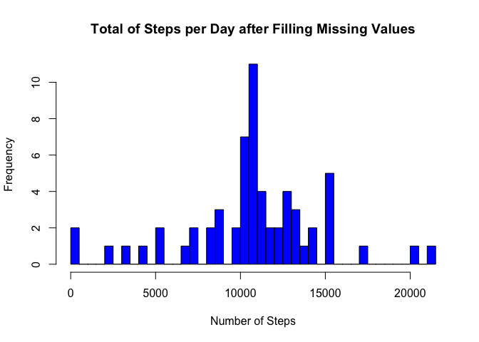

# Reproducible Research: Peer Assessment 1


```r
## loading used libs and setting code to globaly appear along the document
rm(list = ls())
library(ggplot2)
library(knitr)
opts_chunk$set(echo = TRUE)

# setting decimal number output
knit_hooks$set(inline = function(x) {
  prettyNum(round(x,2), big.mark=",")
})
```

## Loading and preprocessing the data

```r
if (!("activity.csv" %in% dir())){
  unzip("activity.zip")
}
actData <- read.csv("activity.csv",
                    header = TRUE,
                    colClasses = c("numeric", "Date", "numeric"),
                    na.strings = "NA")
```

## What is mean total number of steps taken per day?


```r
stepsByDay <- aggregate(actData$steps, by = list(actData$date), FUN = sum)
colnames(stepsByDay) <- c("Date", "Steps")

plot(stepsByDay$Date,
     stepsByDay$Steps,
     type = "h",
     lwd=8,
     main = "Total of Steps per Day",
     xlab = "Date",
     ylab = "Frequency",
     col = "orange")
```

<!-- -->

```r
meanSteps <- mean(stepsByDay$Steps, na.rm=TRUE)
medianSteps <- median(stepsByDay$Steps, na.rm = TRUE)
```

The mean of the total number of steps per day is **10,766.19**.  
The median of the total number of steps per day is **10,766.19**.

## What is the average daily activity pattern?


```r
stepsByInterval <- aggregate(actData$steps, by = list(actData$interval), FUN = mean, na.rm = TRUE)
colnames(stepsByInterval) <- c("interval", "avgSteps")

plot(stepsByInterval$interval,
     stepsByInterval$avgSteps,
     type = "l",
     xlab = "Reading Intervals",
     ylab = "Average Number of Steps",
     main = "Average Daily Activity Pattern")
```

<!-- -->

```r
maxPos <- which(stepsByInterval$avgSteps == max(stepsByInterval$avgSteps))
maxAvgStepsInterval <- stepsByInterval$interval[maxPos]
```

The **835th** 5-minute interval is the interval that, on average across all the days in the dataset, contains the maximum number of steps


## Inputing missing values


The total number of missing values in the dataset is 2,304

Missing values will be filled with the rounded value of the daily average number of steps
at the corresponding 5-minute interval.


```r
filledData <- actData

for (i in c(1:length(filledData$steps))){
  if(is.na(filledData$steps[i])){
    nRow = i %% 288
    if (nRow == 0){
      nRow <- 288
    }
    filledData$steps[i] <- round(stepsByInterval$avgSteps[nRow])
    i <- i + 1
  }
}

stepsByDayFil <- aggregate(filledData$steps, by = list(filledData$date), FUN = sum)
colnames(stepsByDayFil) <- c("Date", "Steps")

plot(stepsByDayFil$Date,
     stepsByDayFil$Steps,
     type = "h",
     lwd=8,
     main = "Total of Steps per Day after Filling Missing Values",
     xlab = "Date",
     ylab = "Frequency",
     col = "green")
```

<!-- -->

```r
meanStepsFil <- mean(stepsByDayFil$Steps, na.rm=TRUE)
medianStepsFil <- median(stepsByDayFil$Steps)
```
The mean of the total number of steps per day after filling missing values is **10,765.64**.  
The median of the total number of steps per day after filling missing values is **10,762**.


## Are there differences in activity patterns between weekdays and weekends?
